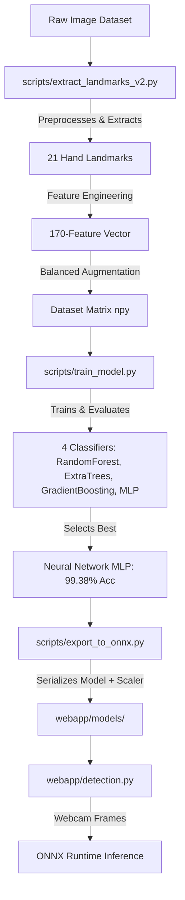

# Real-Time ASL Sign Language Detection Web Application

An AI-powered web application for real-time American Sign Language (ASL) sign language recognition and video transcription. Built using **MediaPipe** for hand landmark tracking, a **Multi-Layer Perceptron (MLP) Neural Network** classifier for high-accuracy predictions, and **Flask + Socket.IO** for real-time web streaming.

This project is structured as a professional, end-to-end Machine Learning web application suitable for academic (MSc final year project) and practical use cases.

---

## 🌟 Features

* **Real-Time Webcam Detection**: Stream video directly from your browser, view real-time hand skeleton overlays, and get instant letters/numbers predictions.
* **Video File Upload & Transcription**: Upload video clips (MP4, AVI, MOV) to transcribe sign language into English text, accompanied by a detailed detection timeline with timestamps.
* **Prediction Smoothing & Noise Filtering**: Utilizes a probability-averaging sliding window filter to prevent prediction flickering and reject transitions.
* **Strict Confidence Gating**: Ignores random hand movements or vague shapes using a 72% confidence threshold filter.
* **Sentence Builder**: Combine detected signs into words/sentences using manual space bar adjustments and backspacing commands.
* **Modern UI/UX**: Professional dark glassmorphic interface built with vanilla HTML/CSS/JS.

---

## 📊 Machine Learning Pipeline

The project features a complete machine learning training and inference pipeline:



### 1. Feature Engineering
Instead of raw pixel classification, we extract a **170-dimensional feature vector** from the 21 MediaPipe hand landmarks:
* **Angles**: 3-point joint angles representing knuckle extensions.
* **Ratios**: Extended aspect ratios of hand height, width, and wrist offsets.
* **Finger Curl Scores**: 5-finger curl indicators measuring how closed each finger is.
* **Adjacent Distances**: Relative distances between adjacent fingertips.
* **Palm Orientation**: Pitch and roll angles calculated using index-MCP, pinky-MCP, and wrist cross-products.

### 2. Model Performance comparison
We trained and evaluated four models on the extracted dataset:

| Model | Validation Accuracy | Training Time | Status |
|---|---|---|---|
| **NeuralNetwork (MLP)** | **99.38%** | 557.4s | **Selected (Best)** |
| **ExtraTrees** | **99.33%** | 3.1s | Alternate |
| **GradientBoosting** | **99.08%** | 84.6s | Alternate |
| **RandomForest** | **98.67%** | 21.7s | Alternate |

### 3. Confusion Resolution (M/N/T, B/5/4, X/Z)
The final Multi-Layer Perceptron (MLP) model achieves exceptional performance on highly similar sign pairs:
* **M / N / T**: **100%** accuracy for M & N, **99.2%** for T.
* **B / 5 / 4**: **100%** accuracy across all three signs.
* **A / S / E**: **100%** accuracy across all three signs.
* **X / Z**: **99.2%** accuracy for X, **99.3%** for Z.

---

## 📂 Project Directory Structure

```
sign_language_detection_project/
├── render.yaml               # Render infrastructure-as-code deployment config
├── .gitignore                # Pushes only application code (ignores datasets/pickles)
├── README.md                 # Project Documentation
├── scripts/                  # Machine Learning pipeline scripts
│   ├── extract_landmarks.py  # Core 170-dim feature extraction logic
│   ├── extract_landmarks_v2.py # Enhanced extraction with aggressive detection
│   ├── train_model.py        # Compares and evaluates classification models
│   ├── export_to_onnx.py     # Exports MLP + StandardScaler to ONNX
│   ├── analyze_confusion.py  # Diagnostic tool for dataset confusion
│   └── diagnose_webcam.py    # Live webcam diagnostic for ONNX model
├── webapp/                   # Flask Web Application
│   ├── app.py                # Server entry point (WebSockets & APIs)
│   ├── detection.py          # Real-time ONNX inference pipeline
│   ├── requirements.txt      # Production python dependencies
│   ├── Procfile              # Render production start instructions
│   ├── models/               # Compiled model assets
│   │   ├── sign_classifier.onnx  # Exported MLP Model (1MB)
│   │   ├── scaler_params.json    # Trained StandardScaler parameters
│   │   └── label_classes.json    # Target class list (36 characters)
│   ├── templates/
│   │   └── index.html        # Web Interface Layout
│   └── static/
│       ├── css/style.css     # Dark mode CSS theme
│       └── js/app.js         # Frontend streaming, canvas drawing & SocketIO
└── asl_dataset/              # Raw Image Dataset (ignored by git)
```

---

## 🛠️ Local Installation & Running

### Prerequisites
* Python 3.10 or 3.11
* Web camera (for real-time webcam tab)

### Running the App
1. Navigate to the webapp directory:
   ```bash
   cd webapp
   ```
2. Install dependencies:
   ```bash
   pip install -r requirements.txt
   ```
3. Start the Flask application:
   ```bash
   python app.py
   ```
4. Open your browser and navigate to **http://localhost:5000**.


## 📄 License

This project is submitted as part of an MSc dissertation. All rights reserved.

---

## 👤 Author

Developed as an MSc Final Year Project.
